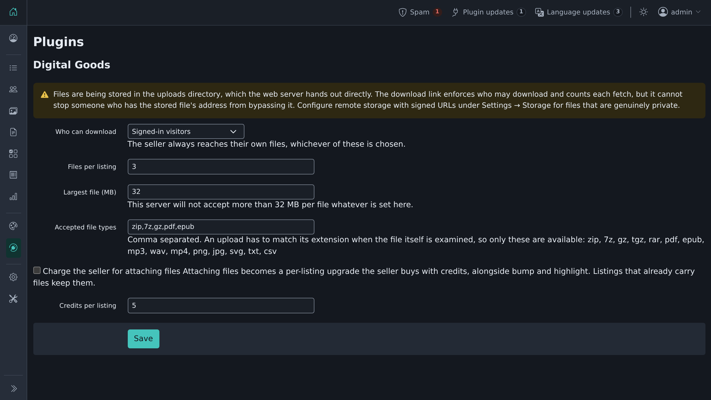

# Digital Goods

Lets a seller attach downloadable files to a listing — a manual, an ebook, a sample pack —
and hands them to buyers through a link that decides who may have them.

## Install

From the admin: **Plugins → Manage plugins → Browse**, find *Digital Goods*, then **Install**.
Or: `php oc-cli.php market:install digital-goods`.

## How files are kept

Uploads go through Shopclass's storage layer under a random key. Nothing about where a
file is kept comes from the person who uploaded it, and the download address is a separate
random token, so a published link says nothing about the storage layout.

Delivery depends on how the site stores files:

| Storage | Delivery |
|---|---|
| Remote with signed URLs (S3 or compatible) | the download link redirects to a short-lived signed URL; the bytes never pass through PHP |
| Local uploads directory | the download link streams the file |

**For files that are genuinely private, configure remote storage with signed URLs.** The
local uploads directory is served by the web server, so while the download link is the
only thing that applies the access rule and counts a fetch, it cannot stop someone who
already has the stored file's address from going straight to it. The settings screen says
so when that is how the site is configured.

## Who can download

One setting, under Plugins → Digital Goods settings:

- **Signed-in visitors** (default)
- **Anyone**
- **The seller only**

The seller always reaches their own files, whichever is chosen.

**Plugins → Digital Goods downloads** lists every attached file, its listing, and how many
times it was downloaded.

## What may be uploaded

The admin lists the accepted extensions. An upload has to match its claimed extension when
the file itself is examined, so only types the plugin can verify are offered:
`zip`, `7z`, `gz`, `tgz`, `rar`, `pdf`, `epub`, `mp3`, `wav`, `mp4`, `png`, `jpg`, `svg`,
`txt`, `csv`. Anything else typed into that field is dropped when the settings are saved.

Per-listing file count and per-file size are settings too; the size is additionally capped
by what PHP will accept, since a limit above `upload_max_filesize` is a promise the server
will not keep.

## Charging for it

Where the site has Shopclass's billing subsystem (6.2.0 and later), attaching files can be
made a paid per-listing upgrade: the seller spends credits on it the same way they buy a
bump or a highlight, and it appears alongside those wherever core lists what credits buy.

It is **off by default** — turning a plugin on should not start charging for something that
was free a moment before. Switch it on under Plugins → Digital Goods settings and set the
price in credits. Listings that already carry files keep them.

Only the seller pays, to attach files. There is no buyer-side purchase.

On 6.1.0 there is no billing subsystem, so attaching files is free.

## Where it applies

Only in the categories you pick — the plugin list's **Configure** link opens the category
chooser. Files appear on the post and edit forms and on the listing itself.

## Requirements

Shopclass 6.1.0 or newer (tested up to 6.4), PHP 8.0 or newer, and the `fileinfo` extension (bundled with PHP
and enabled by default) for checking what an upload actually is.

## History

Rewritten from the Osclass "Digital Goods" plugin (1.1.0, 2013). See CHANGELOG.md for what changed.

## Licence

GPL-3.0-or-later. Derived from Osclass, originally Apache-2.0; both notices are retained
in the source headers.
