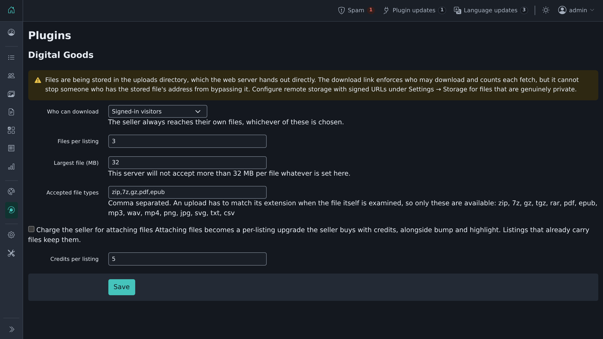

# Digital Goods

Lets a seller attach downloadable files to a listing (a manual, an ebook, a sample pack)
and hands them to buyers through a link that decides who may have them.



## Install

From the admin: **Plugins → Manage plugins → Browse**, find *Digital Goods*, then **Install**.
Or: `php oc-cli.php market:install digital-goods`.

## How files are kept

Uploads are stored under a random key. Nothing about where a file is kept comes from the
person who uploaded it, and the download address is a separate random token.

| Storage | Where files go | Delivery |
|---|---|---|
| Local (default) | `oc-content/downloads/digital-goods/`, closed to the web | the download link streams the file |
| S3 with signed URLs | the bucket | the download link redirects to a signed URL that lasts 5 minutes |
| S3, public bucket | the bucket | the download link streams the file |

Every download goes through the download link, which applies the access rule and counts
the fetch. A public bucket serves any file to whoever has its address; the link never
shows that address, but turn on signed URLs for files that are genuinely private. The
settings screen warns when a public bucket is in use.

### Closing the folder on nginx

On Apache the plugin writes an `.htaccess` that denies the folder. nginx ignores
`.htaccess`; add this to your server block (ShopClass's own Docker images already have it):

```nginx
location ^~ /oc-content/downloads/ {
    deny all;
}
```

To keep the files out of the web root entirely, set a folder in `config.php`:

```php
define('DG_PRIVATE_PATH', '/var/lib/shopclass-files');
```

Set it before files are uploaded, or move the `digital-goods` folder there when you set it.

### Upgrading from 2.0.x

2.0.x kept local files in `oc-content/uploads/digital-goods/`, which the web server
serves. On the first request after the upgrade the plugin moves them to the new folder and
closes the old one with an `.htaccess`. Download links do not change. A file that cannot
be moved is still served through the download link, and the move is retried on the next
request. On nginx you can also deny the old folder:

```nginx
location ^~ /oc-content/uploads/digital-goods/ {
    deny all;
}
```

### Faster downloads (optional)

PHP streams files in chunks and answers byte ranges, so large files do not use memory. To
let the web server send the file instead, set one of these in `config.php`.

nginx:

```nginx
location ^~ /dg-private/ {
    internal;
    alias /path/to/site/oc-content/downloads/digital-goods/;
}
```

```php
define('DG_ACCEL_REDIRECT', '/dg-private/');
```

Apache with `mod_xsendfile` (`XSendFilePath` set to the folder):

```php
define('DG_XSENDFILE', true);
```

## Who can download

One setting, under Plugins → Digital Goods settings:

- **Signed-in visitors** (default)
- **Anyone**
- **The seller only**

The seller always reaches their own files, whichever is chosen.

**Plugins → Digital Goods downloads** lists every attached file, its listing, and how many
times it was downloaded.

## What may be uploaded

The admin lists the accepted extensions. An upload has to match its claimed extension when
the file itself is examined, so only types the plugin can verify are offered:
`zip`, `7z`, `gz`, `tgz`, `rar`, `pdf`, `epub`, `mp3`, `wav`, `mp4`, `png`, `jpg`, `svg`,
`txt`, `csv`. Anything else typed into that field is dropped when the settings are saved.

Per-listing file count and per-file size are settings too; the size is additionally capped
by what PHP will accept, since a limit above `upload_max_filesize` is a promise the server
will not keep.

## Charging for it

Where the site has ShopClass's billing subsystem (6.2.0 and later), attaching files can be
made a paid per-listing upgrade: the seller spends credits on it the same way they buy a
bump or a highlight, and it appears alongside those wherever core lists what credits buy.

It is **off by default**. Turning a plugin on should not start charging for something that
was free a moment before. Switch it on under Plugins → Digital Goods settings and set the
price in credits. Listings that already carry files keep them.

Only the seller pays, to attach files. There is no buyer-side purchase.

On 6.1.0 there is no billing subsystem, so attaching files is free.

## Where it applies

Only in the categories you pick. The **Settings** link next to it in **Plugins → Manage plugins** opens the category
chooser. Files appear on the post and edit forms and on the listing itself.

## Requirements

ShopClass 6.1.0 or newer (tested up to 6.4), PHP 8.0 or newer, and the `fileinfo` extension (bundled with PHP
and enabled by default) for checking what an upload actually is.

## History

Rewritten from the Osclass "Digital Goods" plugin (1.1.0, 2013). See CHANGELOG.md for what changed.

## Licence

GPL-3.0-or-later. Derived from Osclass, originally Apache-2.0; both notices are retained
in the source headers.
